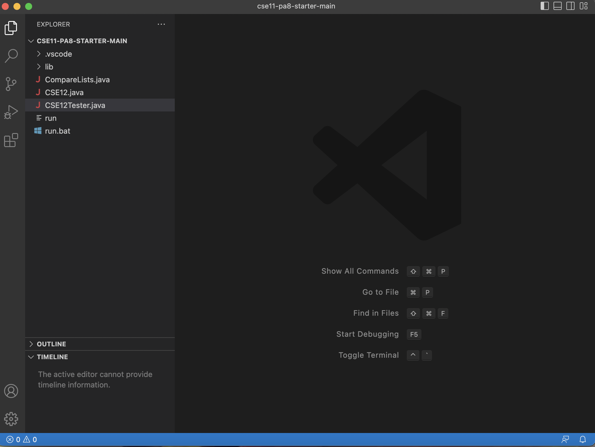

# Lab Report 1 
Note: I have adapted this tutorial to Mac users only as I only have access to a Macbook.
## First step: Downloading & Installing Visual Studio Code
* Visit the visual studio code [website](https://code.visualstudio.com/, ), click the download button on the top right of the website, and download the version for macOS.
* After downloading, run the installer. 
* Once it has been installed, run the program and it should open up a window that looks like this (Ignore the files on the side; if it is newly installed, there should be no files on the side) : 

## Second step: Connecting to a Remote Server
* Now that we have access to an IDE (Integrated Development Environment), we can access a terminal that allows us to connect to a remote server. 
* However, we need to establish a password for our course-specific account for CSE15L so that we can access the remote server using our own accounts. To do this, click [this link](https://sdacs.ucsd.edu/~icc/index.php).
* On this website, you should see an account lookup section that looks like this 
* Enter your username (your UCSD email without the @ucsd.edu) and your Student ID (the ID you use for exams//the ID at the back if your Student ID card), and click Submit.
* You should then be taken to a website that looks like this  (Note that your username may be different to mine, and that your account name will be "cse15l" followed by a string of 4 characters that represent what quarter we are currently in, and subsequently two additional strings that *are unique to you*.) 
* Remember/note down your account name (the string that starts with "cse15l", not your UCSD username).
* Click the "UC San Diego Active Directory (AD) Password Change Tool" link on the website, and change your password to anything of your liking (though it is best to be secure).
## Third step: Traversing a Filesystem using commands

