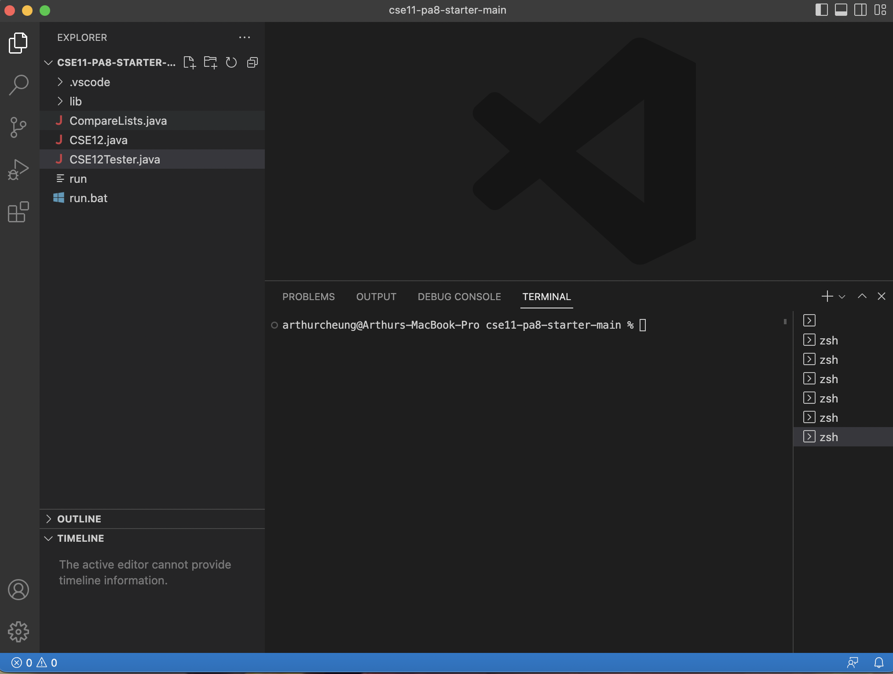
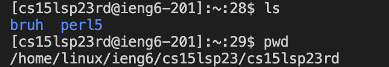
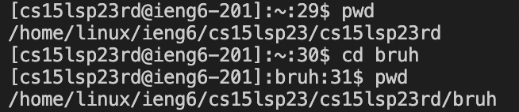

# Lab Report 1 
Note: I have adapted this tutorial to Mac users only as I only have access to a Macbook.
## First step: Downloading & Installing Visual Studio Code
* Visit the visual studio code [website](https://code.visualstudio.com/, ), click the download button on the top right of the website, and download the version for macOS.
* After downloading, run the installer. 
* Once it has been installed, run the program and it should open up a window that looks like this (Ignore the files on the side; if it is newly installed, there should be no files on the side) : 

## Second step: Connecting to a Remote Server
* Now that we have access to an IDE (Integrated Development Environment), we can access a terminal that allows us to connect to a remote server. 
* However, we need to establish a password for our course-specific account for CSE15L so that we can access the remote server using our own accounts. To do this, click [this link](https://sdacs.ucsd.edu/~icc/index.php).
* On this website, you should see an account lookup section that looks like this: 
* Enter your username (your UCSD email without the @ucsd.edu) and your Student ID (the ID you use for exams//the ID at the back if your Student ID card), and click Submit.
* You should then be taken to a website that looks like this  (Note that your username may be different to mine, and that your account name will be "cse15l" followed by a string of 4 characters that represent what quarter we are currently in, and subsequently two additional strings that *are unique to you*.) 
* Remember/note down your account name (the string that starts with "cse15l", not your UCSD username).
* Click the "UC San Diego Active Directory (AD) Password Change Tool" link on the website, and change your password to anything of your liking (though it is best to be secure).
* Now, we can go back to VS code and open a new terminal using the menu bar at the top (Terminal -> New Terminal). 
* You should now see something like this: 
* Click anywhere in the terminal, and type the following command: ssh cs15lsp23zz@ieng6.ucsd.edu. Replace the "zz" in this line with your own account name you noted down from before, and press enter.
* If the terminal asks the following question: "Are you sure you want to continue connecting (yes/no/[fingerprint])?", simply type yes and press enter.
* The terminal should then prompt a password like this: 
* Type the password you just recently set, and press enter. If you entered your password correctly you should then see this in the terminal: 
* Congratulations! You are now connected to the UCSD CSE15L remote server. This is where the fun begins!
## Third step: Traversing a Filesystem using commands
* Now, we can try running commands on the terminal to traverse our filesystem in the remote server. 
* For example, we can enter "ls" in the terminal to see the children directories of the working directory (imagine them as folders inside a folder of a filesystem), or enter "pwd" to print what your current working directory is. 
* This is an example of what happens when I enter ls and pwd: 
* Using the information given to us by the "ls" command, we can use the "cd" command to change our directory to the ones underneath (ie "bruh") like this: 
* Now, we can see that we are in the "bruh" directory using the pwd command: [Image](cdResultSS.png)
* We can also use the "mkdir" command to make a new directory in the working directory like so: [Image](mkdirExampleSS.png)
* You can also use the "cd ~" command to go back to the root directory (ie the first level of directory in the filesystem). [Image](rootExampleSS.png)
* These are just some of the commands I found most interesting, but I would recommend visiting the [main CSE15L week 1 website](https://ucsd-cse15l-s23.github.io/week/week1/) to see other commands you can explore, and testing them out to see what they do if you are interested. That's it for week 1!

