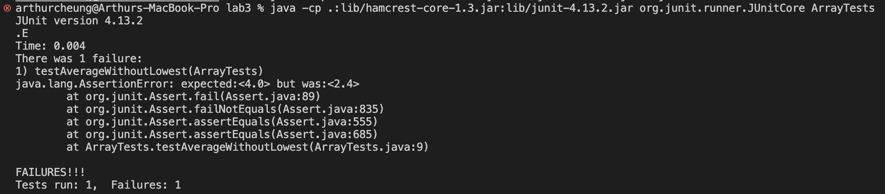
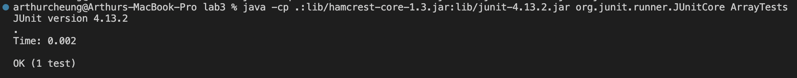

# Lab Report 2
## Part 1: StringServer
* Below is the code for the StringServer.java file that I used to create the StringServer web server:

* Now, here are two screenshots of using `/add-message` followed by a query:

* Before this, the main method was called to start the server. This main method was called during the terminal, with an array of String `args` as an argument. The `port` field is specified to be the first element in `args` (ie the first argument when running StringServer).  In this main method, we call the `Server.start` method, where a new Handler object is created and passed as an argument alongside the `port` field. 
* Secondly, using the new Handler object that was created, this screenshot shows the `handleRequest` method of my code being called. 
* The URL is passed to the `handleRequest` method as an argument (`url`), and in that way the method can compile and run `url.getPath()` to get the path of the localhost URL.
* My code specifies if no path is mentioned in the URL, return nothing, and for paths that contained `/add-message`, it should get the query and add the query part after the `=` sign to the string that we want to show. 
* The `toShow` field which is a part of the Handler class exists and maintains as long as the server is running because it is a field from the same Handler object that was created. So, as we call `handleRequest` by using the `/add-message` path in our localhost, we continually add to whatever `toShow` currently is, meaning we append to the value of `toShow` with this request, able to constantly change its value.
* The `queryParam` field is defined as `url.getQuery().split("=");`, and so it is whatever query was specified in the URL, changing depending on whatever the URL is at the moment.


* The main method here is not called at it has already been called. Calling the main method again would restart the server and make a new Handler object, erasing memory of the toShow field by setting it back to an emtpy String.
* However, here, the `handleRequest` method here is indeed called once again because a new URL has been entered - this time with a different value specified by `/add-message`. Now, the `url` argument that is passed into the `handleRequest` method has changed, and so the value of the `queryParam` field changes accordingly as well. Thus, due to all of this, the `toShow` field retains its value from the last screenshot but now also adds onto the previous String value with the new query parameter that was specified.
## Part 2: Assessing bugs using JUnit
* Below is a failure inducing input for the for the `averagewithoutLowest` method. The input is formatted as a JUnit test method:
```@Test
  public void testAverageWithoutLowest(){
    double[] input = {1,1,1,3,4,5};
    assertEquals(4,ArrayExamples.averageWithoutLowest(input),0.00001);
  }
```
* This is a an input that does not induce failure for the `averagewithoutLowest` method. The input is formatted as a JUnit test method:
```
@Test
  public void testAverageWithoutLowest(){
    double[] input = {1,3,4,5};
    assertEquals(4,ArrayExamples.averageWithoutLowest(input),0.00001);
  }
```

* This is the symptom of the bug in the program, as a screenshot for the ouput when we run the failure-inducing input as a JUnit test:

* This is a screenshot for the ouput when we run the successful input as a JUnit test:


* This is the bug as the before-and-after code fix:

Before:
```
static double averageWithoutLowest(double[] arr) {
    if(arr.length < 2) { return 0.0; }
    double lowest = arr[0];
    for(double num: arr) {
      if(num < lowest) { lowest = num; }
    }
    double sum = 0;
    for(double num: arr) {
      if(num != lowest) { sum += num; }
    }
    return sum / (arr.length - 1);
  }
```

After:
```
  static double averageWithoutLowest(double[] arr) {
    int lowestCounter=0;
    if(arr.length < 2) { return 0.0; }
    double lowest = arr[0];
    for(double num: arr) {
      if(num < lowest) { lowest = num; }
      if (num==lowest){lowestCounter+=1;}
    }
    double sum = 0;
    for(double num: arr) {
      if(num != lowest) { sum += num; }
    }
    return sum / (arr.length - lowestCounter);
  }
```

Explanation: Because this program did not account for the fact that there could be multiple instances of a lowest number, it calculated the average simply by taking the count of numbers as one less than the length of the array (thinking it would be the one lowest number. To work "properly", we need to count for the instances of the lowest numbers and take that into consideration when calculating the average.

## Part 3: What I learned
During weeks 2 and 3, I learned the importance of the definition of a "failure-inducing input". We cannot equate failure-inducing inputs to simply the inputs that cause errors in our program, because this is entirely up to the intention of the program. In fact, there may be some inputs that we *want to cause an error* depending on the design/purpose of our program. Instead, a failure-inducing input is any input that causes an unwanted or unexpected symptom/behaviour in the output of our program.


