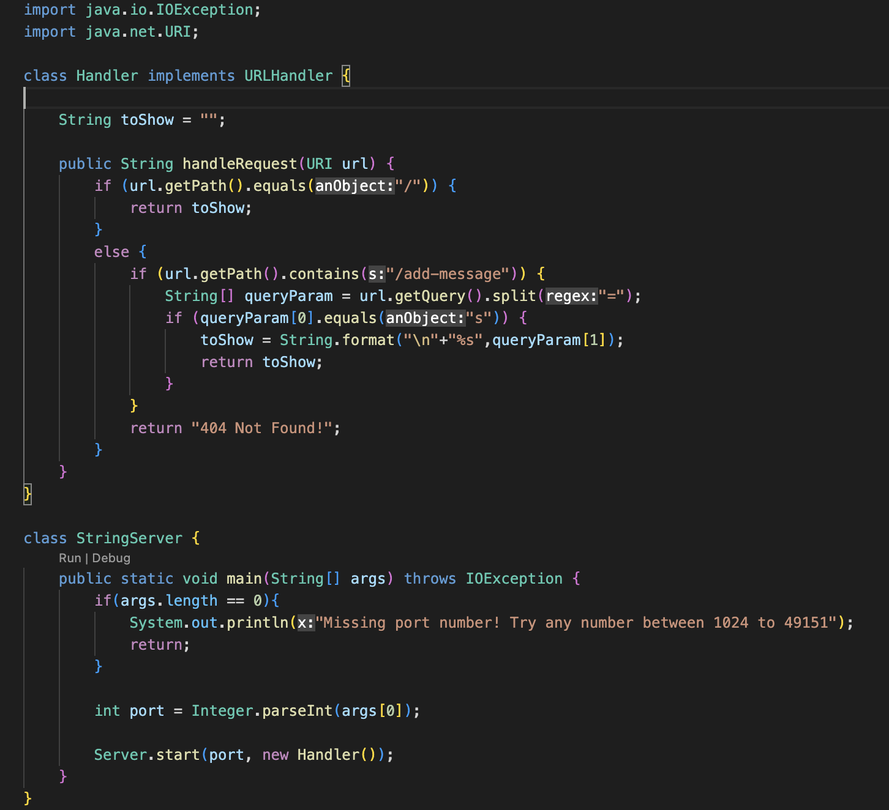
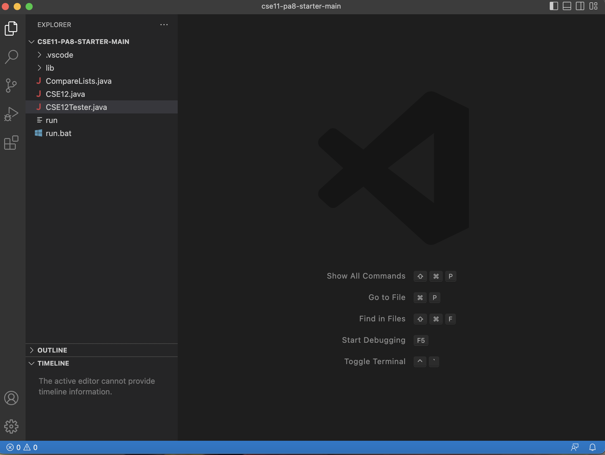

# Lab Report 2
Note: I have adapted this tutorial to Mac users only as I only have access to a Macbook.
## Writing StringServer
* Below is the code for the StringServer.java file that I used to create the StringServer web server:

* After downloading, run the installer. 
* Once it has been installed, run the program and it should open up a window that looks like this (Ignore the files on the side; if it is newly installed, there should be no files on the side) : 
