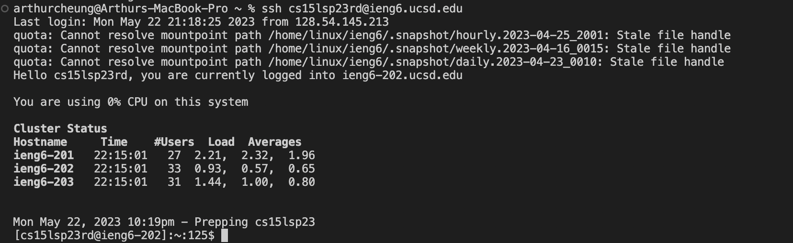
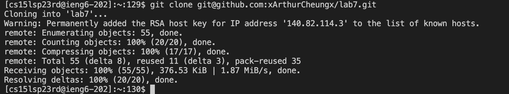
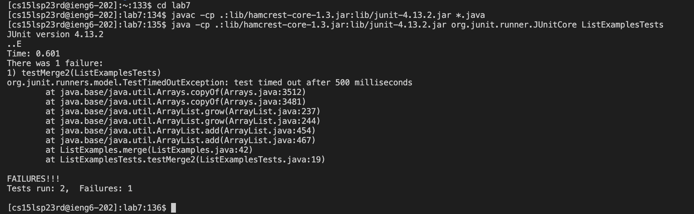
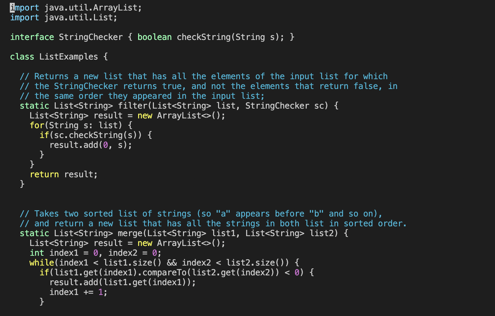
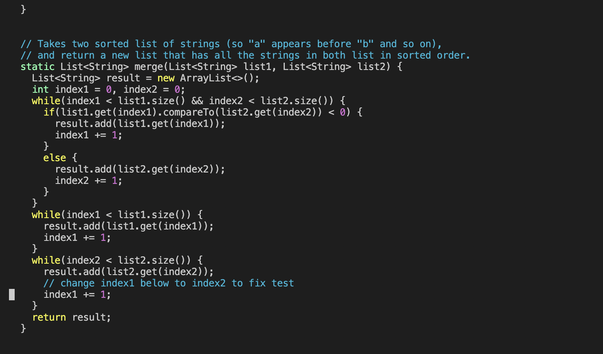
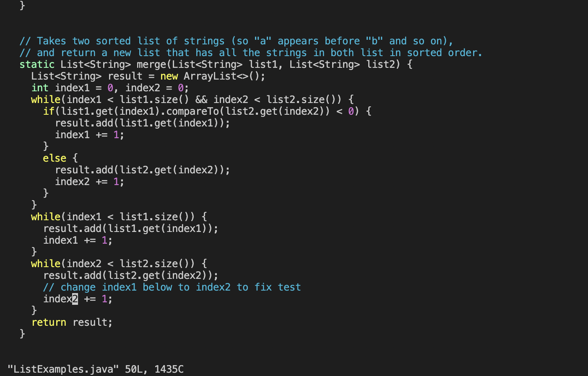
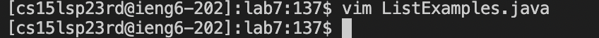
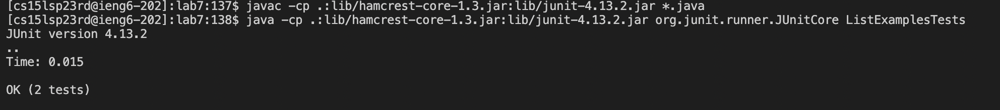
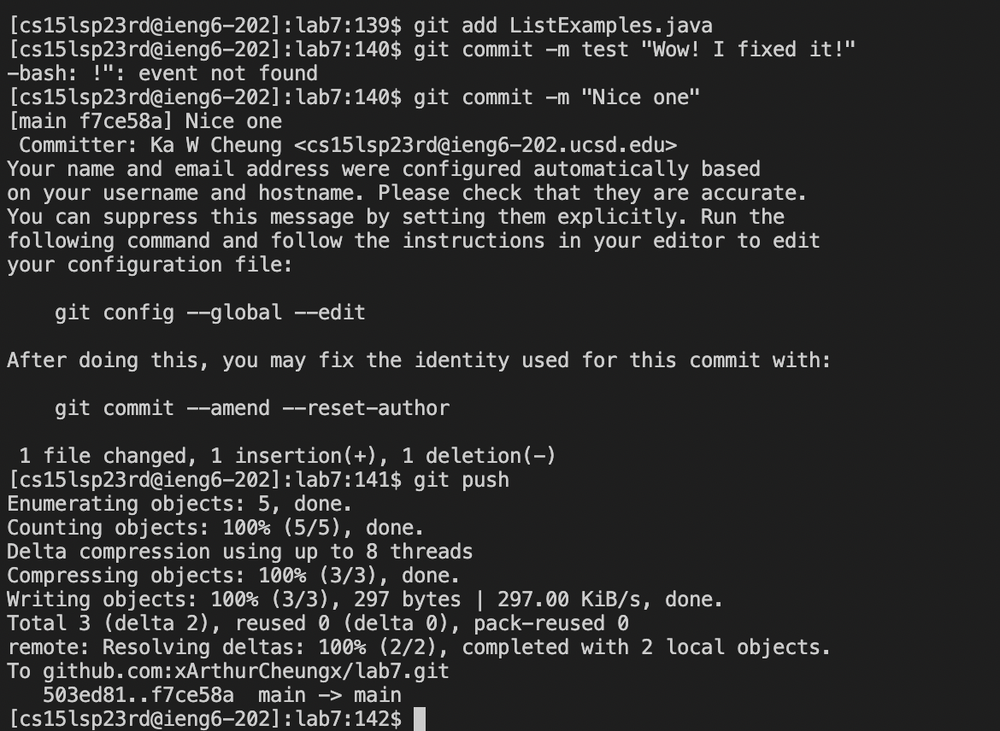

# Lab Report 4: Editing using vim, and pushing changes to Git
## Step 4: Log onto ieng6
Because I previously generated an SSH key for ieng6, I do not need to enter my password. 
I typed in: `ssh cs15lsp23rd@ieng6.ucsd.edu` into the command-line and pressed `<enter>`to log in. 

The ssh command allows me to connect remotely to the ieng6 server, and the chunk of text after that is simply my course-specific account.

## Step 5: Clone your fork of the repository from your Github account
Because I previously generated an SSH key for GitHub as well, I can clone my fork of the repository from my Github account using the SSH link.

So, in order to do this, in the command-line, I type in `git clone git@github.com:xArthurCheungx/lab7.git` and subsequently press `<enter>`

## Step 6: Run the tests, demonstrating that they fail
To run the the tests, we first need to compile them. 
So, I first type in `cd lab7` and press `<enter>` to change my working directory to the lab7 directory we want to work with (the one we just cloned). 

Then, I type in `javac -cp .:lib/hamcrest-core-1.3.jar:lib/junit-4.13.2.jar *.java` and press `<enter>`. This command essentially compiles the Tester and ListExamples java files as well as the JUnit jar files. 

Now, to actually run the tests, I use the `java` command to run the files containing the tests. 

So, I type in   `java -cp .:lib/hamcrest-core-1.3.jar:lib/junit-4.13.2.jar org.junit.runner.JUnitCore ListExamplesTests` and press `<enter>`, which runs the ListExamplesTests class in the ListExamplesTests.java file we just compiled.

Evidently, these tests failed as delineated by JUnit.

## Step 7: Edit the code file to fix the failing test
To fix the error that is located in ListExamples.java I type in `vim ListExamples.java` and press `<enter>`. This puts the command-line in vim, which is Unix text editor. We can now use vim commands to traverse and edit the bugged ListExamples.java file. 

First, in the command-line, scroll to the very top and we will see the java code included in the file. Then, holding the `<shift>` key, press the `h` key. 
You should see something like this:

The `<shift>+h` command allowed us to go to the top of the file, to ensure that we are all starting at the same place. 

Then, type in `43j`. This allows us to move our cursor down 43 times without having to manually press the down key 43 times.
Your cursor should now be here: 

After, type in `e` to get us to the end of the first word, which happens to be what we want to edit. Type `r` to replace a single character, and then type `2` because that is what we want to replace the current character with to fix the code. You should now see that the code has been corrected: 

Finally, type in `:wq` and press `<enter>` to save the changes we just made to the ListExamples.java file and quit vim all at once.
We are now out of vim:

## Step 8: Run the tests, demonstrating that they now succeed
Now, we should run the tests again to see if the changes we made actually fixed the problem. 

Again, we would recompile the files using the command `javac -cp .:lib/hamcrest-core-1.3.jar:lib/junit-4.13.2.jar *.java` and pressing `<enter>`. 

Then, of course, we would run these tests with `java -cp .:lib/hamcrest-core-1.3.jar:lib/junit-4.13.2.jar org.junit.runner.JUnitCore ListExamplesTests` as explained previously.

We now see that both tests in the tester class succeed! Truly a pogchamp moment.

## Step 9: Commit and push the resulting change to your Github account
Now, we want to commit and push the changes we made to Github. 

First, we need to type in the command `git add ListExamples.java` to add the changes we made specifically in the ListExamples.java file to the status (list of things we want to commit).

Then we can type in `git commit -m "Nice one"` (or replace whatever is in the quotation marks with a message of your choice) to commit these changes, saving these changes to our local(ieng6) repository. 

Finally, we type in `git push` to sends these changes to our remote github repository.
We can see all these commands in the screenshow below:

(Ignore the lines where I mistyped the git commit command)
BAM! WE SMURFED IT! (We fixed our code and updated our forked repository on github to reflect these fixes).
