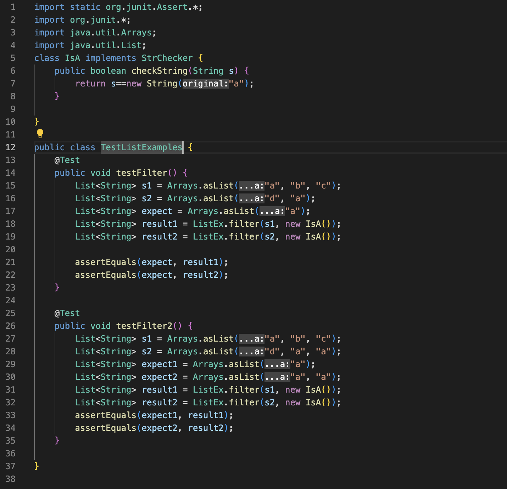

# Lab Report 5: The Final Report (Sadge)
## Part 1: Debugging Scenario
*I'd like to note that I got the java code from Week 9's Wedensday Lecture by fixing the problem we discussed during the lecture of not creating a new list within the filter method itself, and creating a new problem elsewhere. I also got a large portion of my "tests" bash script from scenario 2 of the week 9 lab.*. 

### Student Post:
**Title:Testers failing with correct filter() function for String Checker**

**What environment are you using (computer, operating system, web browser, terminal/editor, and so on)?**

Operating system: macOS

Terminal/editor: VSCode


**Detail the symptom you're seeing. Be specific; include both what you're seeing and what you expected to see instead. Screenshots are great, copy-pasted terminal output is also great. Avoid saying “it doesn't work”.**


I'm expecting to see all tests pass, but instead I see that I get two failures when running my JUNit tester methods.


**Detail the failure-inducing input and context. That might mean any or all of the command you're running, a test case, command-line arguments, working directory, even the last few commands you ran. Do your best to provide as much context as you can.**. 

Below is the code for my 'ListEx' class: 


I'm not quite sure if anything went wrong here, because my filter method does exactly as desired: it creates a new list, and for each element in the list provided as an argument, if that element returns true according to checkString, we add that element to the newly created list. `result` is within the filter method, so it is not an instance variable being updated, but rather we create a new list each time we call filter() as is intended.

Here is my bash script:

And I entered `bash tests.sh` in the command line to get the symptom.
I highly doubt the bug is within the bash script, because all it does is echo and redirect the JUNit tester output into a more readable format.

Now, here is my code for `TestListExamples`:

From the symptom in the command line, we see that the error occurs at line 21 and line 33 of the `TestListExamples`. These would be:
```assertEquals(expect, result1);``` in `testFilter()`
and 
```assertEquals(expect1, result1);``` `in testFilter2()`

My intention for these lines in both `testFilter()` and `testFilter2()` is that I created a list of strings with contents: `"a", "b", "c"`and because there is only one `"a"` in this list, the filter method should return a new list with a single `"a"` in it. My best guess is that Arrays.asList() does not work as I had intended it to.

### TA Response:
Perhaps the bug isn't in the tester methods or the `filter()` method, but rather how you defined `checkString()`? Note that there is a difference between the use of `==` and `.equals()` when comparing two strings.

### Student Reply:
Thank you! I realized that the == operator checks whether the *references* to the objects are equal, so if I compare each `"a"` in the list given with a newly created `"a"` string, it would evidently return false. To fix this, because my intention was to check for each  `"a"` string in the list argument given to filter, I can simply use the `.equals()` method in `checkString()` instead like so:


and now all the tests pass:


### Final Setup Information:


## Part 2: Reflection
